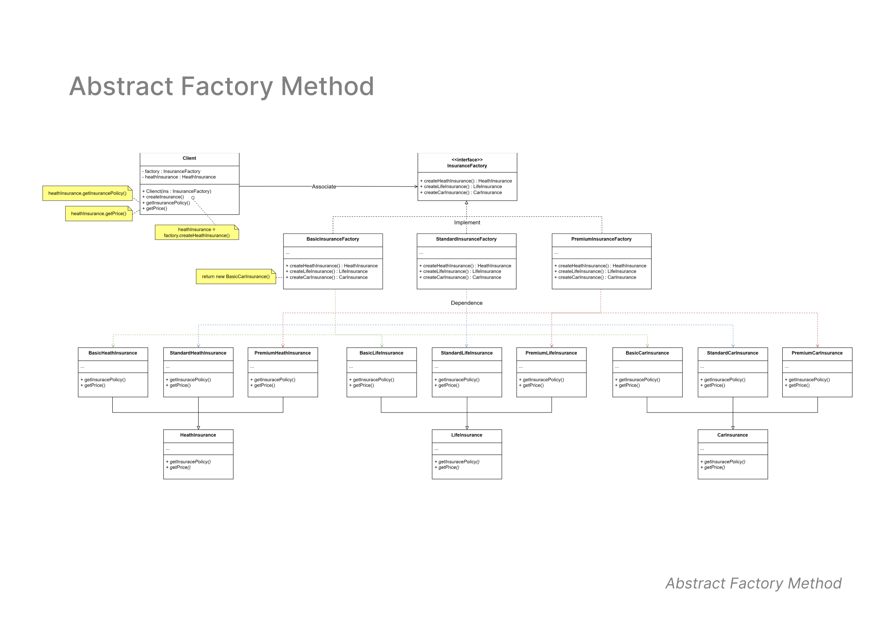

# Abstract Factory Method Pattern

## Overview
The **Abstract Factory Method Pattern** provides an interface for creating families of related or dependent objects **without specifying their concrete classes**. It helps ensure that the system is decoupled from specific implementations and promotes consistency among product families.

---

## Class Diagram

Below is the class diagram for the Abstract Factory Method Pattern:

---

## Structure

1. **InsuranceFactory** *(Interface)*  
   - Defines the abstract methods for creating different types of insurance:
     - `createHealthInsurance()`
     - `createLifeInsurance()`
     - `createCarInsurance()`

2. **Concrete Factories**  
   Implement the `InsuranceFactory` interface to create specific families of insurance:  
   - **BasicInsuranceFactory**  
   - **StandardInsuranceFactory**  
   - **PremiumInsuranceFactory**  

3. **Insurance Types (Products)**  
   Families of related products:  
   - **HealthInsurance**: Includes `BasicHealthInsurance`, `StandardHealthInsurance`, `PremiumHealthInsurance`.  
   - **LifeInsurance**: Includes `BasicLifeInsurance`, `StandardLifeInsurance`, `PremiumLifeInsurance`.  
   - **CarInsurance**: Includes `BasicCarInsurance`, `StandardCarInsurance`, `PremiumCarInsurance`.  

4. **Client**  
   - The client uses a factory to get an insurance product without needing to know its concrete class.

---

## Benefits of Abstract Factory Pattern

- **Decouples Client Code**: The client does not depend on specific product implementations.  
- **Promotes Consistency**: Ensures that products created by a factory belong to the same family.  
- **Easier to Manage Product Families**: New product families can be added without modifying existing code.  

---

## How It Works

1. The **Client** interacts with the `InsuranceFactory` interface to request products.  
2. The appropriate **Concrete Factory** (Basic, Standard, or Premium) is instantiated based on the client's requirements.  
3. The factory creates specific products (Health, Life, or Car Insurance) which all implement common product interfaces.

---

## Use Cases

- When a system needs to create families of related or dependent objects.  
- When the system should be independent of how its objects are created and represented.  
- When enforcing consistency among products is required.

---

## Conclusion

The Abstract Factory Method Pattern is useful when dealing with families of related objects. It allows the system to remain independent of concrete product implementations while maintaining flexibility and scalability.

---

## Diagram Path
Make sure the diagram image is placed in the project directory under:  
`creational/abstract-factory-method/AllPatternDesign-2.AbstractFactory.jpg`
