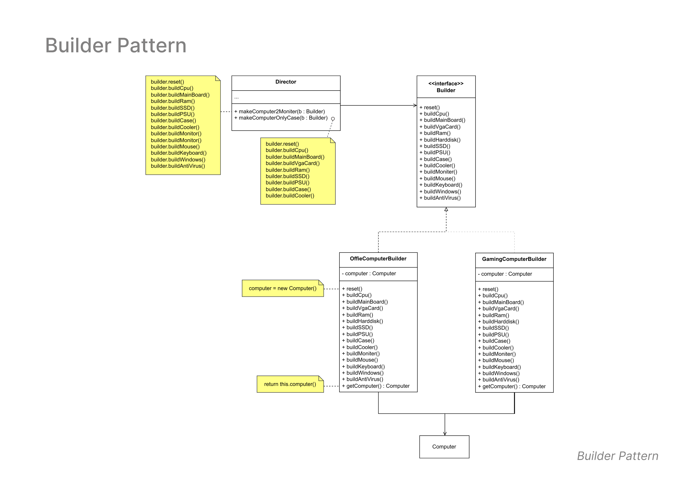

# Builder Pattern

## Overview
The **Builder Pattern** separates the construction of a complex object from its representation, allowing the same construction process to create various representations. This pattern is particularly useful when a product requires many steps to construct or when the construction process must allow different representations of the constructed object.

---

## Class Diagram

The class diagram below illustrates the structure of the Builder Pattern implemented in this example:

---

## Structure

- **Builder (Interface)**  
   Defines all the steps necessary to construct a product. Each step returns the same builder to allow chaining:
   - `buildCpu()`
   - `buildMainBoard()`
   - `buildVgaCard()`
   - `buildRam()`
   - ... (additional components)

- **Concrete Builders**  
   Implement the Builder interface to provide specific implementations for building the parts of the product:
   - **OfficeComputerBuilder**  
   - **GamingComputerBuilder**

- **Director**  
   Constructs an object using the Builder interface. Director defines the order of construction steps to create different types of products.

- **Product**  
   - Represents the complex object being built. In this case, it’s a `Computer`.
