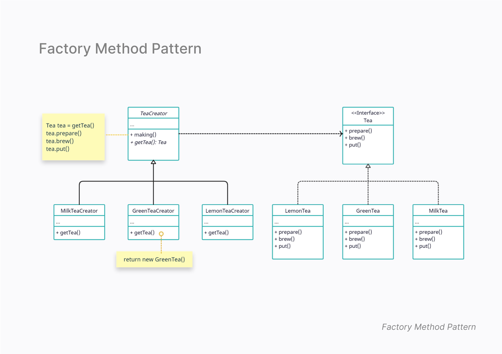

# Factory Method Pattern

## Overview
The Factory Method Pattern provides an interface for creating objects, but allows subclasses to alter the type of objects created.

## Class Diagram

Below is the class diagram for the Factory Method Pattern:

[View Factory Method Diagram (PDF)](factory-method-diagram.pdf)

## Structure
- **Tea.java** - The interface for tea.
- **GreenTea.java**, **MilkTea.java**, **LemonTea.java** - Concrete implementations of tea.
- **TeaCreator.java** - Abstract class defining the factory method.
- **GreenTeaCreator.java**, **MilkTeaCreator.java**, **LemonTeaCreator.java** - Concrete factories.
