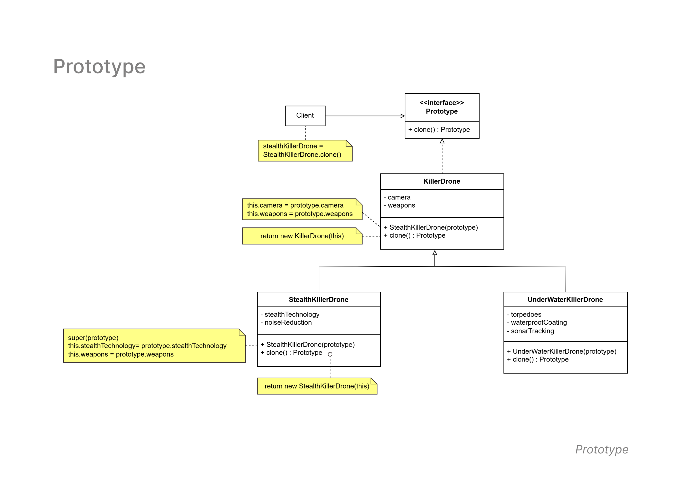

# Prototype Pattern
   - **Diagram Description:**
     The Prototype pattern is used to create objects based on a template or prototype. It allows cloning of objects without needing to know their exact class type. This pattern is often used to create copies of complex objects efficiently.

- **Class Diagram**

  The class diagram below illustrates the structure of the Prototype Pattern implemented in this example:

  

   - **Classes Involved:**
     - `Prototype`: An interface defining the `clone()` method, which allows the cloning of objects.
     - `KillerDrone`: A general class for creating drones.
     - `StealthKillerDrone`: A subclass of `KillerDrone`, which adds specific attributes for stealth drones.
     - `UnderWaterKillerDrone`: A subclass of `KillerDrone` for underwater drones.

   - **Key Concepts:**
     - The `clone()` method allows objects to be copied, with specific attributes (e.g., stealth technology or underwater capabilities) cloned from a prototype.
     - The `StealthKillerDrone` and `UnderWaterKillerDrone` classes inherit from `KillerDrone`, and both implement the `clone()` method.

   - **Use Case:**
     This pattern is useful when you want to create copies of an object with similar properties but potentially different characteristics or configurations.
