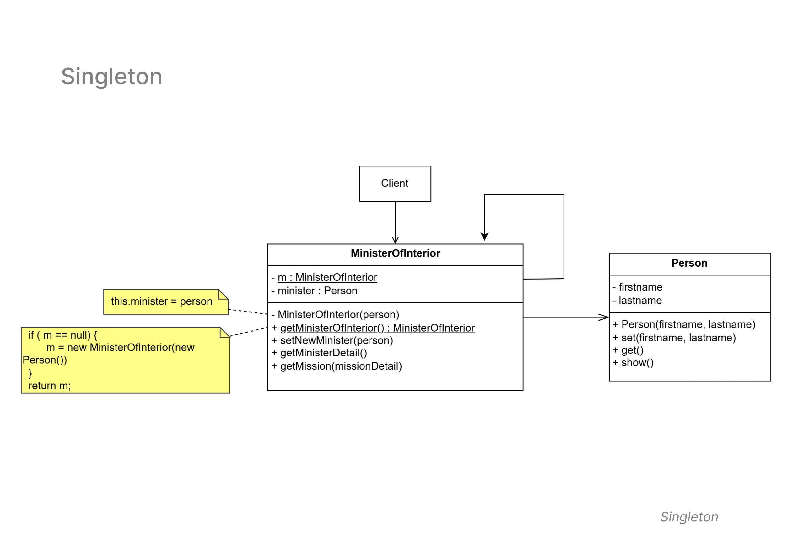

# Singleton Pattern

   - **Diagram Description:**
     The Singleton pattern ensures that a class has only one instance and provides a global point of access to that instance. This pattern is particularly useful for cases where you need to coordinate actions across the system or access shared resources.

- **Class Diagram**

  The class diagram below illustrates the structure of the Singleton Pattern implemented in this example:

---

   - **Classes Involved:**
     - `MinisterOfInterior`: A singleton class that ensures only one instance of the `MinisterOfInterior` exists.
     - `Person`: A class representing a person, which is used by `MinisterOfInterior` to define the minister.
     - `Client`: The client uses the singleton instance of `MinisterOfInterior` and calls various methods to interact with the system.

   - **Key Concepts:**
     - The constructor of `MinisterOfInterior` is private, ensuring no multiple instances are created.
     - A static method `getMinisterOfInterior()` is used to access the single instance.
   
   - **Use Case:**
     This pattern is used in scenarios where having multiple instances of a class can cause errors, such as when managing system resources or configurations that should be shared globally.

---
