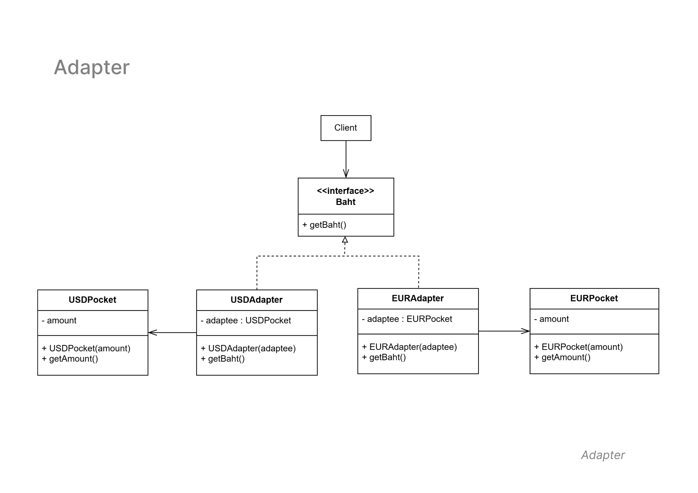

# Adapter Pattern
   - **Diagram Description:**
     
     The Adapter pattern is used to convert one interface into another that a client expects. It allows classes with incompatible interfaces to work together by providing a wrapper or adapter class.

  - **Class Diagram**

     Below is the class diagram for the Adapter Pattern:

   - **Classes Involved:**
     - `USDAdapter` and `EURAdapter`: Adapters that allow the `USD Pocket` and `EUR Pocket` classes to be converted into the `Baht` interface.
     - `USDPocket` and `EURPocket`: Classes that represent pockets with USD and EUR currencies.
     - `Baht`: Interface representing the target currency that the adapters convert to.

   - **Key Concepts:**
     - The `USDAdapter` and `EURAdapter` adapt the respective currency classes (`USDPocket` and `EURPocket`) into the `Baht` interface.
     - The `getBaht()` method is implemented by both adapters to provide the conversion functionality.

   - **Use Case:**
     This pattern is commonly used when you need to integrate systems or components that use different interfaces or formats but need to work together in a system.
