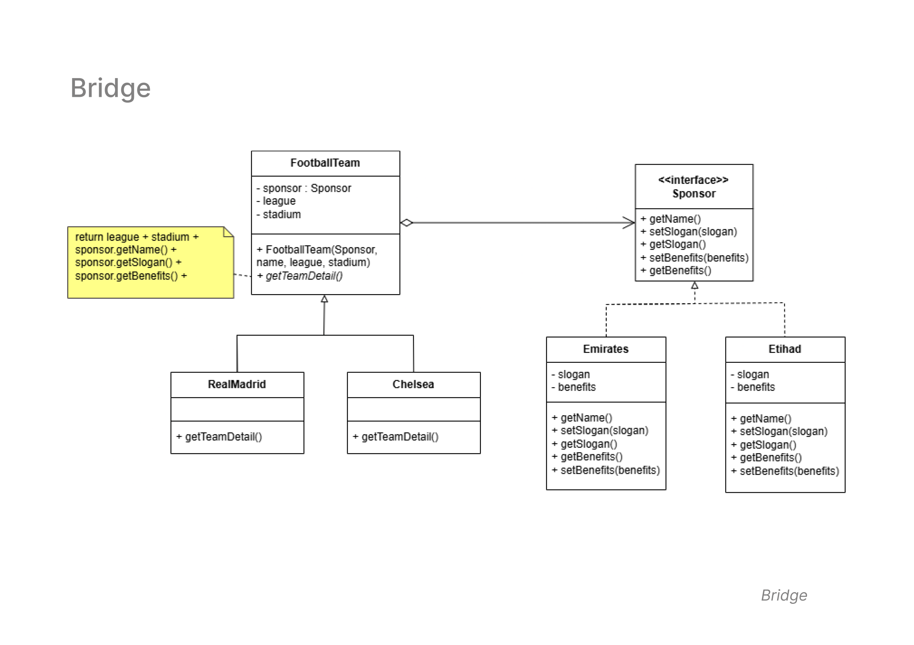

# Bridge Pattern
   - **Diagram Description:**
     The Bridge pattern decouples an abstraction from its implementation, allowing the two to vary independently. This pattern is typically used when you need to separate a class’s abstraction (interface) from the details of how it is implemented.
  
  - **Class Diagram**
  Below is the class diagram for the Bridge Pattern:

   - **Classes Involved:**
     - `FootballTeam`: Represents a football team that has a sponsor and details like name, league, and stadium.
     - `Sponsor`: An interface with methods related to the sponsor’s name, slogan, and benefits.
     - `RealMadrid` and `Chelsea`: Concrete implementations of `FootballTeam`, with specific sponsor details.
     - `Emirates` and `Etihad`: Concrete implementations of `Sponsor`, each representing different sponsors for the teams.

   - **Key Concepts:**
     - The `FootballTeam` class holds a reference to a `Sponsor` and uses it to get the sponsor’s details like name, slogan, and benefits.
     - The `Sponsor` interface allows different sponsor types (`Emirates`, `Etihad`) to be used interchangeably with various football teams.

   - **Use Case:**
     This pattern is ideal when you need to decouple an abstraction from its implementation, allowing you to change or extend either part without affecting the other. It's commonly used in scenarios where you want to define multiple variations of a product, such as teams with various sponsors.

