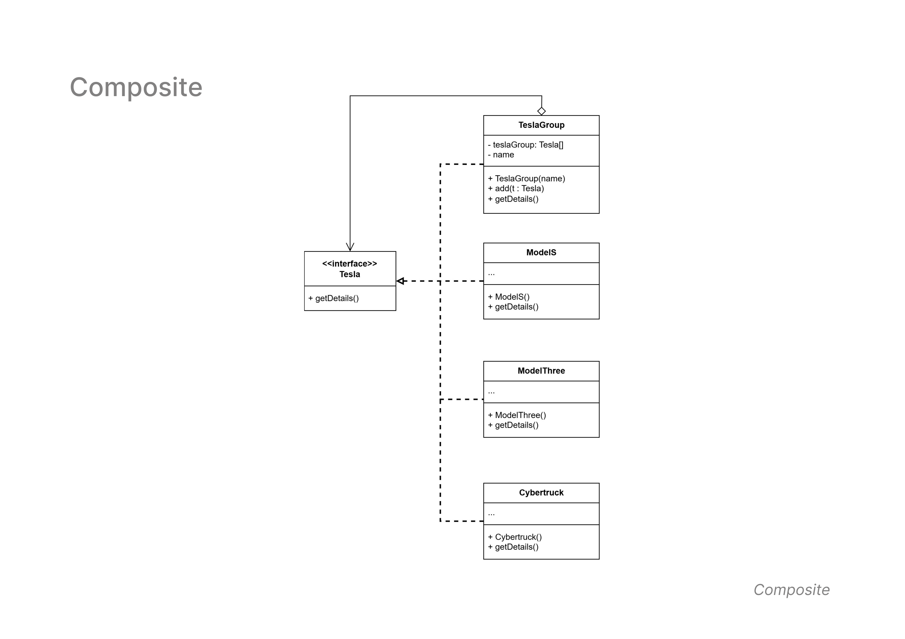

## Composite Pattern

- **Diagram Description:**  
  The **Composite Pattern** allows you to compose objects into tree structures to represent part-whole hierarchies. It lets clients treat individual objects and compositions of objects uniformly.

- **Class Diagram:**  
  Below is the class diagram for the Composite Pattern:

  

- **Classes Involved:**
  - `Tesla` (Interface): Defines a common method `getDetails()` for all Tesla models.
  - `ModelS`, `ModelThree`, `Cybertruck`: Concrete implementations of `Tesla`, representing different Tesla car models.
  - `TeslaGroup`: A composite class that holds a collection of `Tesla` objects and provides group-level operations.

- **Key Concepts:**
  - `TeslaGroup` acts as a **composite** that can hold multiple `Tesla` objects.
  - The pattern enables **uniform treatment** of individual objects (`ModelS`, `ModelThree`, etc.) and groups (`TeslaGroup`).

- **Use Case:**  
  Useful when dealing with **hierarchical structures** such as file systems, GUI components, or organizational structures.
