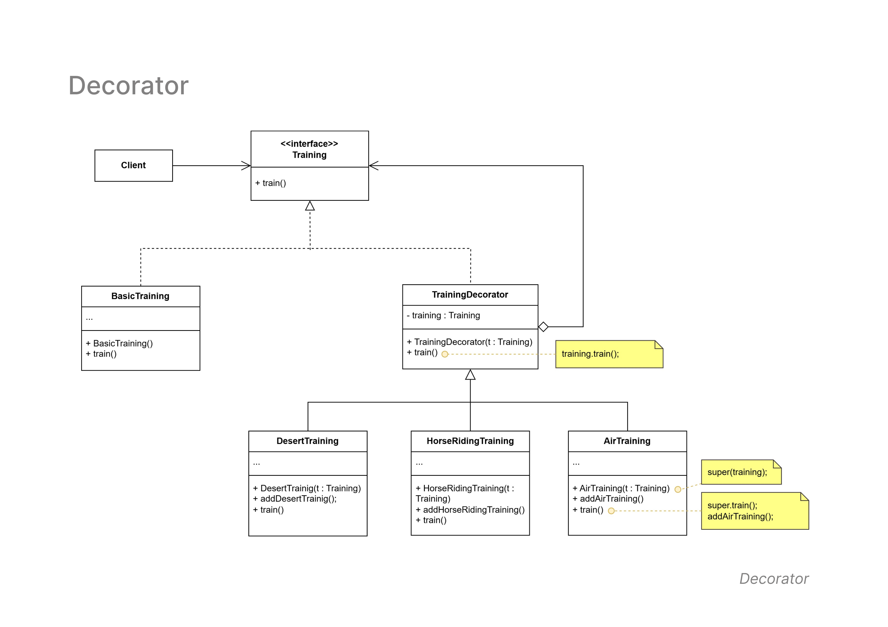

## Decorator Pattern

- **Diagram Description:**  
  The **Decorator Pattern** dynamically adds behavior to an object at runtime without modifying its base structure. It allows flexible extension of functionalities.

- **Class Diagram:**  
  Below is the class diagram for the Decorator Pattern:

  

- **Classes Involved:**
  - `Training` (Interface): Defines the base method `train()`.
  - `BasicTraining`: A concrete class implementing `Training`.
  - `TrainingDecorator`: A wrapper class that extends the behavior of `Training`.
  - `DesertTraining`, `HorseRidingTraining`, `AirTraining`: Concrete decorators adding specific training types.

- **Key Concepts:**
  - `TrainingDecorator` wraps an instance of `Training`, allowing new behaviors to be added dynamically.
  - The pattern enables **extensibility** without modifying existing classes.

- **Use Case:**  
  Commonly used in **UI components**, **logging systems**, and **data transformation** scenarios.
