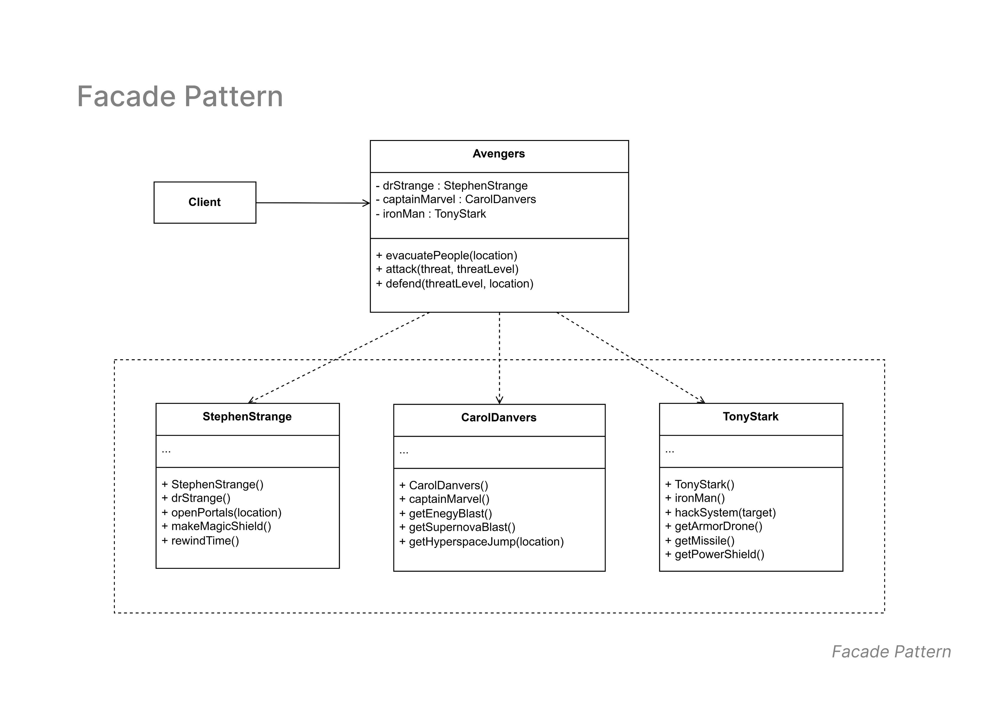

# Facade Pattern

## Overview
The **Facade Pattern** provides a unified interface to a set of interfaces in a subsystem. It simplifies the interaction between clients and complex subsystems by acting as a single entry point.

In this example, the **Avengers** facade class simplifies access to the abilities of **Stephen Strange (Doctor Strange)**, **Carol Danvers (Captain Marvel)**, and **Tony Stark (Iron Man)**.

---

## Class Diagram

Below is the class diagram for the Facade Pattern:

---

## Structure

### 1. **Facade Class**
- **Avengers.java**  
   The facade class that simplifies interaction with complex subsystems. It provides methods such as:
   - `evacuatePeople(location)`
   - `attack(threat, threatLevel)`
   - `defend(threatLevel, location)`

### 2. **Subsystem Classes**
These classes represent the subsystems that the facade interacts with:  

- **StephenStrange.java** *(Subsystem 1)*  
   - `openPortals(location)` - Opens portals for evacuation.  
   - `makeMagicShield()` - Creates a magical shield.  
   - `rewindTime()` - Rewinds time to defend or correct actions.  

- **CarolDanvers.java** *(Subsystem 2)*  
   - `getEnergyBlast()` - Fires an energy blast at the threat.  
   - `getSupremeNovaBlast()` - Unleashes a powerful nova blast.  
   - `getHyperspaceJump(location)` - Performs a hyperspace jump for relocation.  

- **TonyStark.java** *(Subsystem 3)*  
   - `hackSystem(target)` - Hacks enemy systems to neutralize threats.  
   - `getArmorDrone()` - Deploys an armor drone for support.  
   - `getMissile()` - Launches a missile.  
   - `getPowerShield()` - Activates a defensive power shield.

### 3. **Client Class**
- **Client.java**  
   The client interacts with the `Avengers` facade class to trigger actions without directly dealing with the subsystems.
