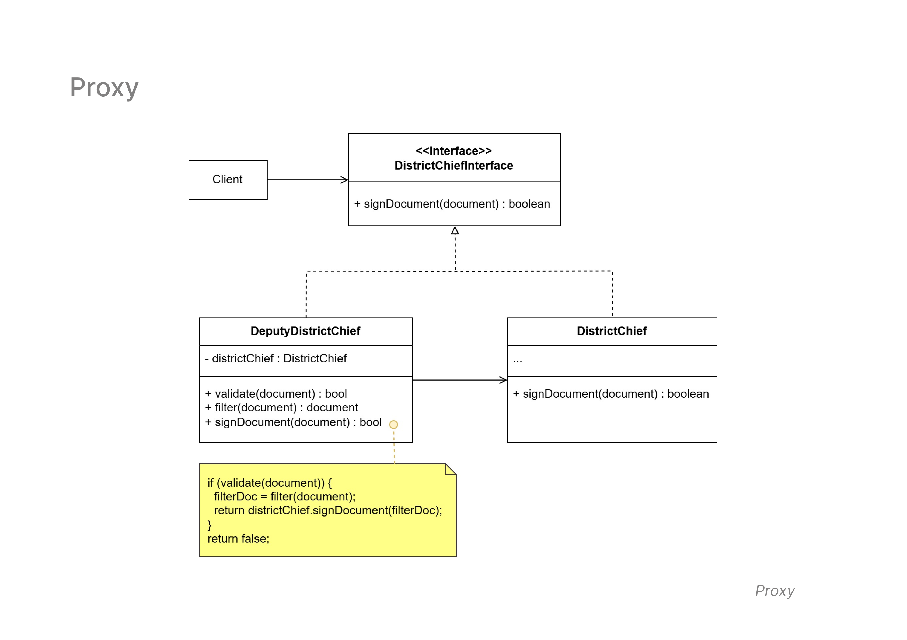

## Proxy Pattern

- **Diagram Description:**  
  The **Proxy Pattern** provides a surrogate or placeholder to control access to an object, adding security, caching, or lazy initialization.

- **Class Diagram:**  
  Below is the class diagram for the Proxy Pattern:

  

- **Classes Involved:**
  - `DistrictChiefInterface` (Interface): Defines the method `signDocument(document)`.
  - `DistrictChief`: A real object implementing `signDocument()`.
  - `DeputyDistrictChief`: A proxy that adds validation and filtering before passing requests to `DistrictChief`.

- **Key Concepts:**
  - The **proxy (`DeputyDistrictChief`)** controls access to the **real object (`DistrictChief`)**.
  - Enhances security by validating and filtering documents before signing.

- **Use Case:**  
  Useful in **security proxies**, **lazy loading**, and **caching mechanisms**.
